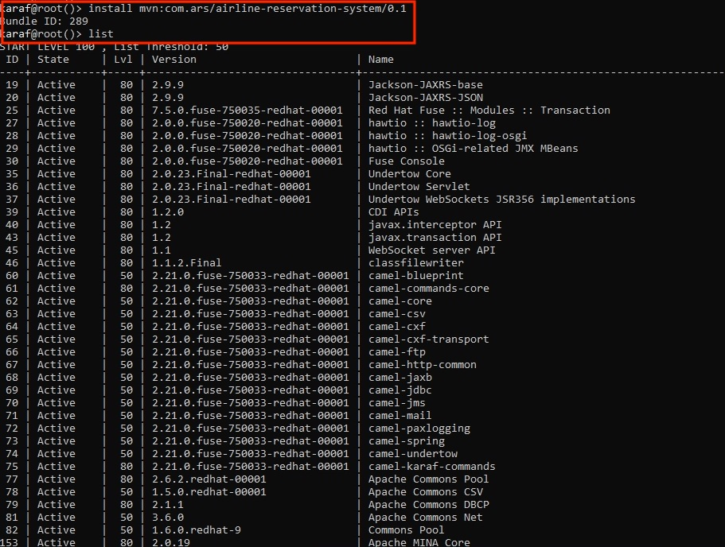
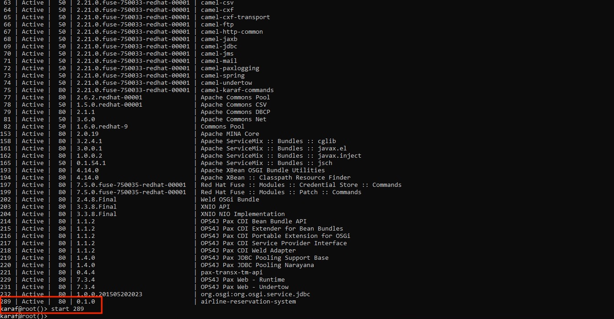

# Air Reservation System for ABC Airlines

This repository is a very basic sample backed via static response.  
It only demonstrates how a osgi bundle is deployed with JBoss Fuse over karaf.  
The bundle creates a jax-rs server listening at http://localhost:9000/employeeService via spring context.  
The Redhat fuse console runs at default http://localhost:8181/.  

#Pre requisites:
1. Jboss Fuse installation
2. Environment setup with java and maven

#Steps to build:
1. Build using mvn clean install.
2. Log in to console
3. Install bundle from maven repository.

ss1
<Get Bundle>

4. Start bundle

Bundle gets registered at cxf server.

